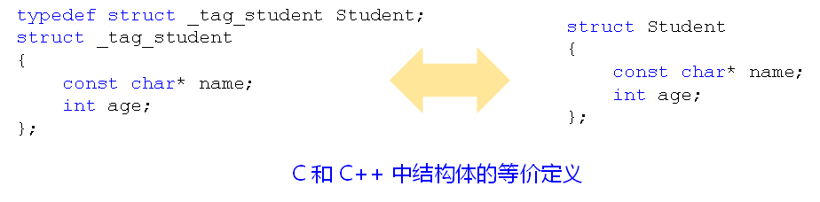

# C到C++的升级
## C与C++的关系
- C++<span style="color:blue;">继承了所有的C特性</span>
- C++在C的基础上<span style="color:red;">提供了更多的语法和特性</span>
- C++的设计目标是<span style="color:purple;">运行效率与开发效率的统一</span>
<div align=center>
 
</div>

## C到C++的升级
- C++更强调语言的<span style="color:red;">实用性</span>
- 所有的<span style="color:purple;">变量</span>都可以在<span style="color:purple;">需要使用时再定义</span>
    ```c
    int c = 0;
    for (int i = 1; i <= 3; i++)
    {
        for(int j = 1; j <= 3; j++)
        {
            c += i * j;
        }
    }
    ```
    <span style="color:blue;">
    对比：
    C语言中的变量都必须在作用域开始的位置定义
    </span>
- <span style="color:blue;">register</span>关键字<span style="color:red;">请求</span>编译器将<span style="color:purple;">局部变量存储于寄存器中</span>
  - 在C++中依然支持<span style="color:blue;">register</span>关键字
  - <span style="color:green;">C++编译器有自己的优化方式</span>
    - C语言中无法获取<span style="color:blue;">register</span>变量的地址
    - C++中可以取得<span style="color:blue;">register</span>变量的地址     
- C++中的<span style="color:blue;">register</span>关键字
  <span style="color:brown;">C++编译器发现程序中需要取register变量的地址时，register对变量的声明变得无效</span>
  <span style="color:blue;">早期C语言编译器不会对代码进行优化，因此register变量是一个很好的补充</span>
- 在C语言中，重复<span style="color:red;">定义多个同名的全局变量是合法的</span>
- 在C++中，<span style="color:purple;">不允许定义多个同名的全局变量</span>
  <span style="color:brown;">C语言中多个同名的全局变量最终会被链接到全局数据区的同一个地址空间</span>
- <span style="color:blue;">struct</span>关键字的加强
  - C语言中的<span style="color:blue;">struct</span>定义了<span style="color:red;">一组变量的集合</span>
  - C语言中<span style="color:blue;">struct</span>定义的<span style="color:teal ;">标识符</span>并不是<span style="color:fuchsia;">一种全新的类型</span>
  - C++中的<span style="color:blue;">struct</span>用于定义一个全新的类型
<div align=center>
 
</div>

- C++中的所有<span style="color:blue;">标识符都必须显示的声明类型</span>
- C语言中<span style="color:red;">默认类型在C++中是不合法的</span>
- 在C语言中
  - <span style="color:blue;">int</span> f()表示<span style="color:blue;">返回值</span>为<span style="color:blue;">int</span>,<span style="color:red;">接受任意参数的函数</span>
  - f(<span style="color:blue;">void</span>)表示返回值为<span style="color:blue;">int</span>的<span style="color:purple;">无参函数</span>
- 在C++中
  - <span style="color:blue;">int</span> f()和<span style="color:blue;">int</span> f(<span style="color:blue;">void</span>)具有<span style="color:red;">相同的意义</span>
    - 表示返回值为<span style="color:blue;">int</span>的无参函数
## 小结
- C++更<span style="color:blue;">强调实用性</span>，可以在<span style="color:red;">任意的地方声明变量</span>
- C++中的<span style="color:blue;">register</span>只是一个<span style="color:fuchsia;">兼容的作用</span>
- C++的编译器能够<span style="color:maroon ;">更好的进行优化</span>
- C++中的<span style="color:maroon ;">任意标识符都必须显示的指明类型</span>