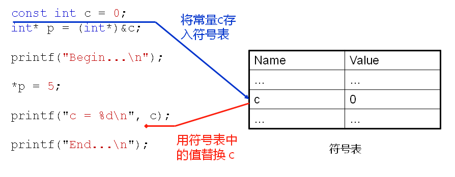

# 进化后的const分析
## C语言中的const
- const修饰的变量是只读的，本质还是变量
- const修饰的局部变量在栈上分配空间
- const修饰的全局变量在只读存储区分配空间
- const只在编译器有用，在运行期无用
  const修饰的变量不是真的常量，它只是告诉编译器该变量不能出现在赋值符号的左边

- C语言中的const使得变量具有只读属性
- const将具有全局生命周期的变量存储于只读存储区
  const不能定义真正意义上的常量！

## C++中的const
- C++在C的基础上对const进行了进化处理
  - 当碰见const声明时在符号表中放入常量
  - 编译过程中若发现使用常量则直接以符号表中的值替换
  - 编译过程中若发现下述情况则给对应的常量分配存储空间
    - 对const常量使用了extern
    - 对const常量使用&操作符
    注意：
    C++编译器虽然可能为const常量分配空间，但不会使用其存储空间中的值

 

- C语言中的const变量
  - C语言中的const变量是只读变量，会分配存储空间
- C++中的const常量
  - 可能会分配存储空间
    - 当const常量为全局，并且需要再其他文件中使用
    - 当使用&操作符对const常量取地址
- C++中的const常量类似于宏定义
  - const int c = 5; ≈ #define c 5
- C++中的const常量在与宏定义不同
  - const常量是由编译器处理
  - 编译器对const常量进行类型检查和作用域检查
  - 宏定义由预处理器处理，单纯的文本替换

## 小结
- 与C语言不通，C++中的const不是只读变量
- C++中的const是一个真正意义上的常量
- C++编译器可能会为const常量分配空间
- C++完全兼容C语言中const常量的语法特性