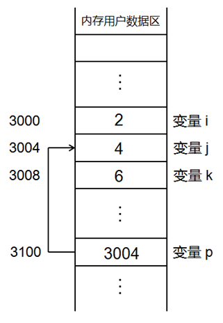

# 布尔类型和引用
## 布尔类型
- C++中的布尔类型
  - C++在C语言的基本类型系统上增加了bool
  - C++中的bool可取的值只有true和false
  - 理论上bool只占用一个字节
  注意：
  true代表真值，编译器内部用1来表示
  false代表非真值，编译器内部用0来表示 
- bool类型只有true(非0)和false(0)两个值
- C++编译器会将非0值转换为<strong style="color: Fuchsia;">true</strong>
- 布尔类型是C++中的基本数据类型
  - 可以定义bool类型的全局变量
  - 可以定义bool类型的常量
  - 可以定义bool类型的指针
  - 可以定义bool类型的数组
  - 。。。

## 三目运算符
- C++对三目运算符进行了升级
- C语言中的三目运算符返回的是<strong style="color: Fuchsia;">变量值</strong>
  - 不能作为左值使用
- C++中的三目运算符可直接返回<strong style="color: Fuchsia;">变量本身</strong>
  - 既可作为右值使用，又可作为左值使用
  注意：
  三目运算符可能返回的值中如果有一个是常量值，则不能作为左值使用
  

## C++中的引用
- 变量名回顾
  - 变量是一段实际连续存储空间的别名
  - 程序中通过变量来申请并命名存储空间
  - 通过变量的名字可以使用存储空间

 

- 在C++中新增加了引用的概念
  - 引用可以看做一个已定义变量的别名
  - 引用的语法：Type& name = var;
  注意：
  普通引用在定义时必须用同类型的变量进行初始化。
  
- C++对三目运算符做了什么？
  - 当三目运算符的可能返回都是变量时，返回的是变量的引用
  - 当三目运算符的可能返回中有常量时，返回的是值

## 小结
- bool类型是C++新增加的基础类型
- bool类型的值只能是true和false 
- C++中的三目运算符可作为左值使用
- C++中的引用可以看做变量的别名来使用
- 三目运算符的可能返回都是变量时，返回的是引用 
