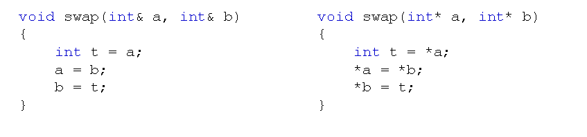
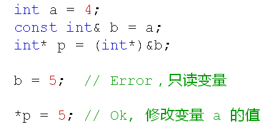
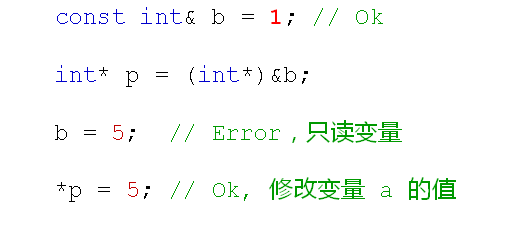
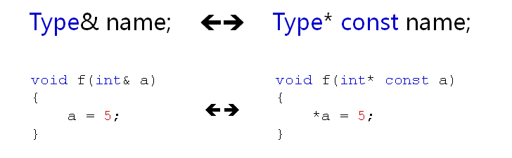

# 引用的本质分析
## 引用的意义
- 引用作为变量别名而存在，因此在一些场合可以代替指针
- 引用相对于指针来说具有更好的可读性和实用性

 

  
注意：
  函数中的引用形参不需要进行初始化！！

## 特殊的引用
- const引用
  - 在C++中可以声明const引用
  - const Type& name = var;
  - const引用可以让变量拥有只读属性
  

  - 当使用常量对const引用进行初始化时，C++编译器会为常量值分配空间，并将引用名作为这段空间的别名。
  

  结论：
  使用常量对const引用初始化后将生成一个只读变量！！！

## 引用的本质
- 引用在C++中的内部实现是一个指针常量
  
  注意：
  1. C++编译器在编译过程中用指针常量作为引用的内部实现，因此引用所占用的空间大小与指针相同
  2. 从使用的角度，引用只是一个别名，C++为了实用性而隐藏了引用的存储空间这一细节

## 引用的意义
- C++中的引用旨在大多数的情况下代替指针
  - 功能性：可以满足多数需要使用指针的场合
  - 安全性：可以避开由于指针操作不当而带来的内存错误
  - 操作性：简单已用，又不失功能强大

## 小结
- 引用作为变量别名而存在旨在代替指针
- const引用可以使得变量具有只读属性
- 引用在编译器内部使用指针常量实现
- 引用的最终本质为指针
- 引用可以尽可能的避开内存错误
