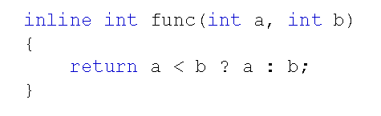

# 内联函数分析
## 常量与宏回顾
- C++中的const常量可以替代宏常数定义，如：
  
    
  C++中是否有解决方案替代宏代码片段？

## 内联函数
- C++中推荐使用内联函数替代宏代码片段
- C++中使用inline关键字声明内联函数
  
  

  内联函数声明时inline关键字必须和函数定义结合在一起，否则编译器会直接忽略内联请求
- C++编译器可以将一个函数进行内联编译
- 被C++编译器内联编译的函数叫做内联函数
- C++编译器直接将函数体插入函数调用的地方
- 内联函数没有普通函数调用时的额外开销(压栈，跳转，返回)
  C++编译器不一定满足函数的内联请求
- 内联函数具有普通函数的特征(参数检查，返回类型等)
- 函数的内联请求可能被编译器拒绝
- 函数被内联编译后，函数体直接扩展到调用的地方
  宏代码片段由预处理器处理，进行简单的文本替换，没有任何编译过程，因此可能出现副作用
- 现代C++编译器能够进行编译优化，一些函数即使没有inline声明，也可能被内联编译
- 一些现代C++编译器提供了扩展语法，能够对函数进行强制内联，如：
  - g++: \_\_attribute__((always_inline))属性
  - MSVC: \_\_forceinline
  
## 注意事项
- C++中inline内联编译的限制：
  - 不能存在任何形式的循环语句
  - 不能存在过多的条件判断语句
  - 函数体不能过于庞大
  - 不能对函数进行取址操作
  - 函数内联声明必须在调用语句之前

## 小结
- C++中可以通过inline声明内联函数
- 编译器直接将内联函数扩展到函数调用的地方
- inline只是一种请求，编译器不一定允许这种请求
- 内联函数省去了函数调用时压栈，跳转和返回的开销