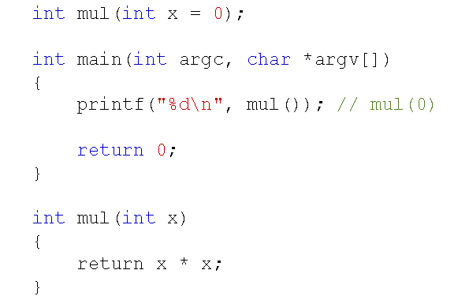
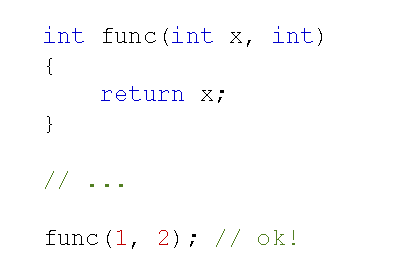

# 函数参数的扩展
## 函数参数的默认值
- C++中可以在函数声明时为参数提供一个默认值
- 当函数调用时没有提供参数的值，则使用默认值
  
  

- 参数的默认值必须在函数声明中指定
- 函数默认参数的规则
  - 参数的默认值必须从右向左提供
  - 函数调用时使用了默认值，则后续参数必须使用默认值
  
## 函数占位参数
- 在C++中可以为函数提供占位参数
  - 占位参数只有参数类型声明，而参数名声明
  - 一般情况下，在函数体内部无法使用占位参数
  
  

- 函数占位参数的意义
  - 占位参数与默认参数结合起来使用
  - 兼容C语言程序中可能出现的不规范写法
  
## 小结
- C++中支持函数参数的默认值
- 如果函数调用时没有提供参数值，则使用默认值
- 参数的默认值必须从右向左提供
- 函数调用时使用了默认值，则后续参数必须使用默认值
- C++中支持占位参数，用于兼容C语言中不规范的写法