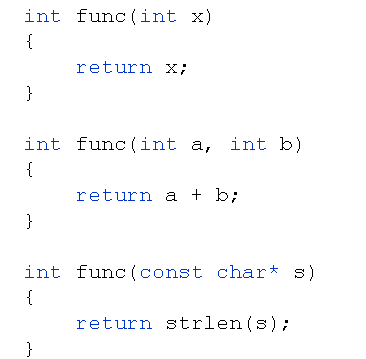
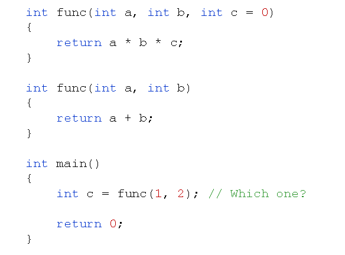

# 函数重载分析(上)
## 自然语言中的上下文
- 你知道下面词汇中"洗"字的含义吗？

结论：
- 能和“洗”字搭配的词汇有很多
- “洗”字和不同的词汇搭配有不同的含义
  
## 重载的概念
- 重载
  - 如果一个标识符在不同的上下文有不同的意义
  - 如：
    - “洗”和不同的词汇搭配后又不同的含义
    - “play”和不同的单次搭配后又不同的含义
  
## C++中的函数重载
- 函数重载
  - 用同一个函数名定义不同的函数
  - 当函数名和不同的参数搭配时函数的含义不同
  
  

- 函数重载至少满足下面一个条件
  - 参数个数不同
  - 参数类型不同
  - 参数顺序不同
- 当函数默认参数遇上函数重载会发生什么？
  
  

- 编译器调用重载函数的准则
  - 将所有同名函数作为候选者
  - 尝试寻找可行的候选函数
    - 精确匹配实参
    - 通过默认参数能够匹配实参
    - 通过默认类型转换匹配实参
  - 匹配失败
    - 最终寻找到的候选函数不唯一，则出现二义性，编译失败
    - 无法匹配所有候选者，函数未定义，编译失败
- 函数重载的注意事项
  - 重载函数在本质上是相互独立的不同函数
  - 重载函数的函数类型不同
  - 函数返回值不能作为函数重载的依据
  函数重载是由函数名和参数列表决定的

## 小结
- 函数重载是C++中引入的概念
- 函数重载用于模拟自然语言中的词汇搭配
- 函数重载使得C++具有更丰富的语义表达能力
- 函数重载的本质为相互独立的不同函数
- C++中通过函数名和列表参数确定函数调用
