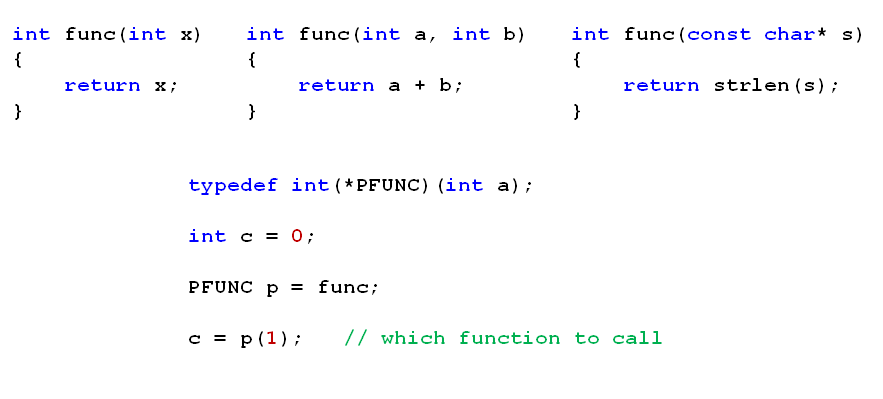
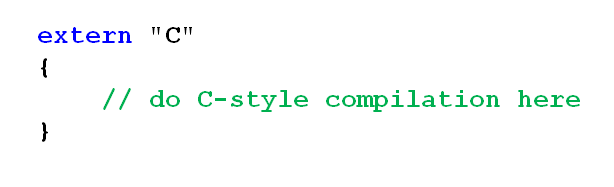
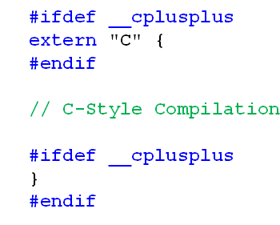

# 函数重载分析(下)
## 重载与指针
- 下面的函数指针将保存哪个函数的地址？
  
  

- 函数重载遇上函数指针
  - 将重载函数名赋值给函数指针时
    1. 根据重载规则挑选与函数指针参数列表一致的候选者
    2. 严格匹配候选者的函数类型与函数指针的函数类型
- 注意
  - 函数重载必然发生在同一个作用域
  - 编译器需要用参数列表或函数类型进行函数选择
  - 无法直接通过函数名得到重载函数的入口地址
  
## C++和C相互调用
- 实际工程中C++和C代码相互调用是不可避免的
- C++编译器能够兼容C语言的编译方式
- C++编译器会优先使用C++的编译方式
- extern关键字能强制让C++编译器进行C方式的编译
  
  

## 如何让一段代码只用C的方式进行编译
- __cplusplus是C++编译器内置的标准宏定义
- __cplusplus的意义
  - 确保C代码以统一的C方式被编译成目标问题
  
  

## 注意事项
- C++编译器不能以C的方式编译重载函数
- 编译方式决定函数名被编译后的目标名
  - C++编译方式将函数名和参数列表编译成目标名
  - C编译方式只将函数名作为目标名进行编译

## 小结
- 函数重载是C++对C的一个重要升级
- 函数重载通过函数参数列表区分不通的同名函数
- extern关键字能够实现C和C++的相互调用
- 编译方式决定符号表中的函数名的最终目标名