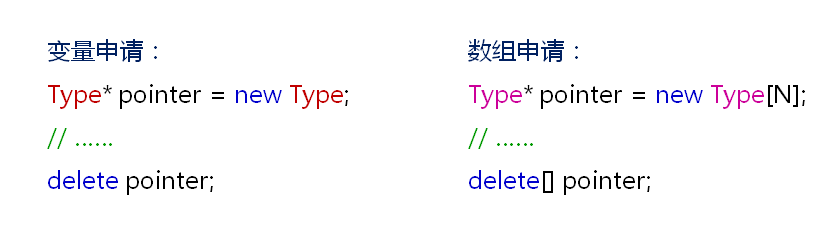
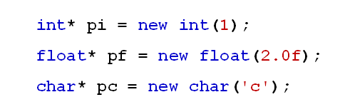
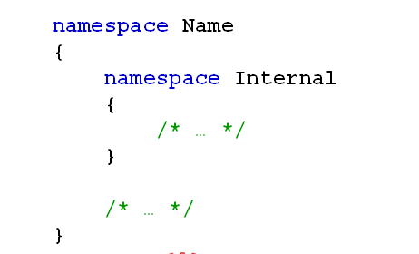

# C++中的新成员
## 动态内存分配
- C++中的动态内存分配
  - C++中通过new关键字进行动态内存申请
  - C++中的动态内存申请是基于类型进行的
  - delete关键字用于内存释放
  
  

- new关键字与malloc函数的区别
  - new关键字是C++的一部分
  - malloc是由C库提供的函数
  - new以具体类型位单位进行内存分配
  - malloc以字节位单位进行内存分配
  - new在申请单个类型变量时可进行初始化
  - malloc不具备内存初始化的特性
- new关键字的初始化
  
  

## C++中的命名空间
- 在C语言中只有一个全局作用域
  - C语言中所有的全局标识符共享同一个作用域
  - 标识符之间可能发生冲突
- C++中提出了命名空间的概念
  - 命名空间将全局作用域分成不同的部分
  - 不同命名空间中的标识符可以同名而不会发生冲突
  - 命名空间可以相互嵌套
  - 全局作用域也叫默认命名空间
- C++命名空间的定义
  
  

- C++命名空间的使用
  - 使用整个命名空间：using namespace name;
  - 使用命名空间中的变量：using name::variable
  - 使用默认命名空间中的变量：::variable
  
## 小结
- C++中内置动态内存分配的专用关键字 
- C++中的动态内存分配可以同时进行初始化 
- C++中的动态内存分配是基于类型进行的 
- C++中命名空间概念用于解决名称冲突问题