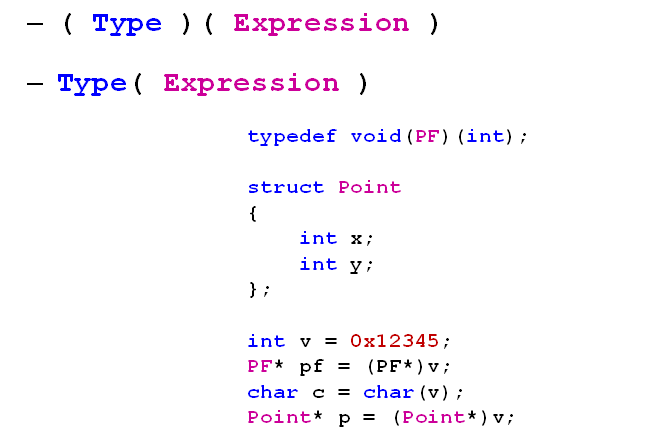
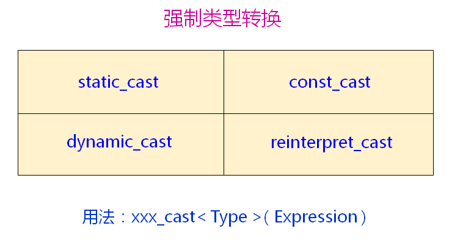

# 新型的类型转换
## 强制类型转换
- C方式的强制类型转换
  
  

- C方式强制类型转换存在的问题
  - 过于粗暴
    - 任意类型之间都可以进行转换，编译器很难判断其正确性
  - 难于定位
    - 在源码中无法快速定位所有使用强制类型转换的语句

## 新式类型转换
- C++将强制类型转换分为4种不同类型
  
  

- static_case强制类型转换
  - 用于基本类型间的转换
  - 不能用于基本类型指针间的转换
  - 用于有继承关系类对象之间的转换和类指针之间的转换
- const_case强制类型转换
  - 用于去除变量的只读属性
  - 强制转换的目标类型必须是指针或引用
- reinterpret_case强制类型转换
  - 用于指针类型间的强制转换
  - 用于整数和指针类型间的强制转换
- dynamic_case强制类型转换
  - 用于有继承关系的类指针间的转换
  - 用于有交叉关系的类指针间的转换
  - 具有类型检查的功能
  - 需要虚函数的支持

## 小结
- C方式的强制类型转换
  - 过于粗暴
  - 潜在的问题不易被发现
  - 不易在代码中定位
- 新式类型转换以C++关键字的方式出现
  - 编译器能够帮助检查潜在的问题
  - 非常方便的在代码中定位
  - 支持动态类型识别(dynamic_cast)