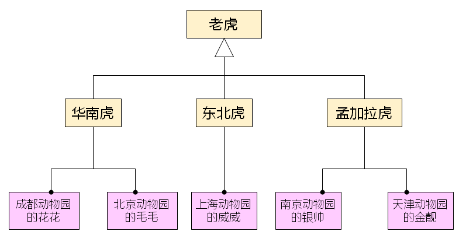
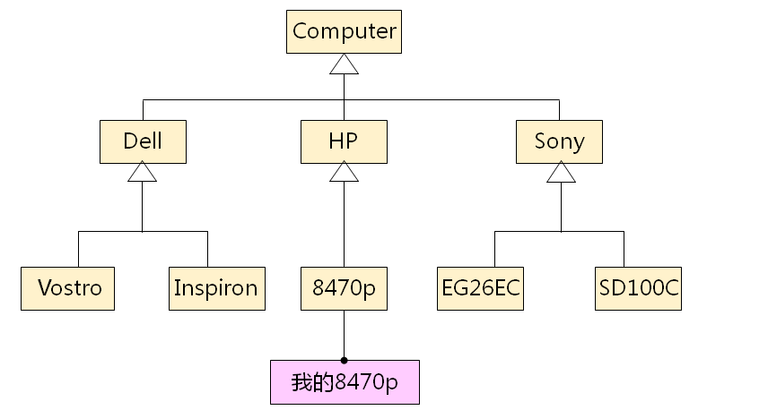

# 进阶面向对象(上)
## 面向对象基本概念
- 面相对象的意义在于
  - 将日常生活中习惯的思维方式引入程序设计中
  - 将需求中的概念直观的映射到解决方案中
  - 以模块为中心构建可复用的软件系统
  - 提高软件产品的可维护性和可扩展性
- 类和对象是面向对象中的两个基本概念
  - 类：指的是一类事物，是一个抽象的概念
  - 对象：指的是属于某个类的具体实体
  - 类是一种模型，这种模型可以创建出不同的对象实体
  - 对象实体是类模型的一个具体实例
  一个类可以有很多对象，而一个对象必然属于某个类
- 生活中的类和对象
  
  

  

- 类和对象的意义
  - 类用于抽象的描述一类事物所持有的属性和行为
    - 如：电脑拥有CPU，内存和硬盘，并且可以开机和运行程序
  - 对象是具体的事物，拥有所属类中描述的一切属性和行为
    - 如：每一只老虎都有不同的体重，不同的食量以及不同的性情
  
## 小结
- 面向对象是当今软件开发中的重要方法
- 类和对象是面向对象理论中的基本概念
- 类和对象均来源于日常生活中
- 每个类可以有多个对象
- 每个对象必然属于某个类