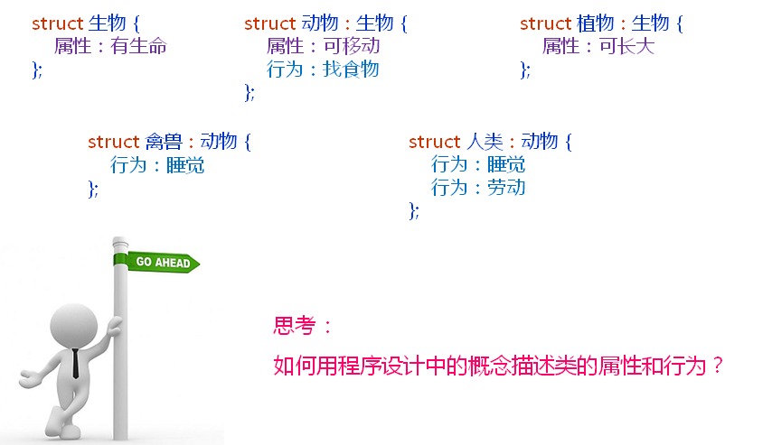

# 进阶面向对象(下)
## 面向对象基本概念
- 类之间的基本关系
  - 继承
    - 从已存在类细分出来的类和原类之间具有继承关系(is-a)
    - 继承的类(子类)拥有原类(父类)的所有属性和行为
  - 组合
    - 一些类的存在必须依赖于其他的类，这种关系叫组合
    - 组合的类在某一个局部上由其他的类组成
- 类之间的基本关系 - 继承
  
  

- 类之间的基本关系 - 组合

## 类的表示法

## 类的表示法 - 简化

## 类的表示法 - 改进1

## 类的表示法 - 改进2

## 类的表示法 - 改进3

## 类的表示法 - 改进4

## 小结
- 类之间可以存在继承关系或组合关系
- 继承关系中子类拥有父类的一切属性和行为
- 组合关系是类之间的整体和部分的关系
- 类及类之间的关系可以有不同的表示法
- 编译器对类的表示法有具体的要求