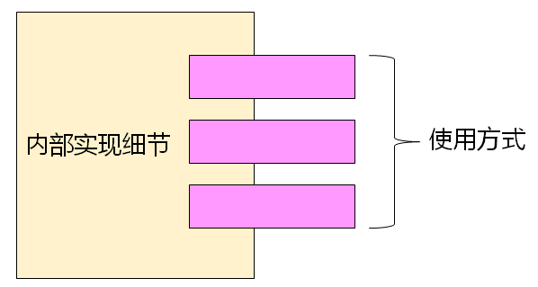

# 类与封装的概念
## 类的封装
- 类通常分为以下两个部分
  - 类的实现细节
  - 类的使用方式
  
  

- 当使用类时，不需要关心其实现细节
- 当创建类时，才需要考虑其内部实现细节
- 封装的基本概念
  - 根据经验：并不是类的每个属性都是对外公开的
    - 如：女孩子不希望外人知道自己的体重和年龄
    - 如：男孩子不希望比尔呢知道自己的身高和收入
  - 而一些类的属性是对外公开的
    - 如：人的姓名，学历，国籍等
  - 必须在类的表示法中定义属性和行为的公开级别
    - 类似文件系统中文件的权限
- C++中类的封装
  - 成员变量：C++中用于表示类属性的变量
  - 成员函数：C++中用于表示类行为的函数
  - C++中可以给成员变量和成员函数定义访问级别
    - public: 
      - [x] 成员变量和成员函数可以在类的内部和外界访问和调用
    - private: 
      - [x] 成员变量和成员函数只能在类的内部被访问和调用

## 类成员的作用域
- 类成员的作用域都只在类的内部，外部无法直接访问
- 成员函数可以直接访问成员变量和调用成员函数
- 类的外部可以通过类变量访问public成员
- 类成员的作用域与访问级别没有关系
        C++中struct定义的类中所有成员默认为public
## 小结
- 类通常可以分为使用方法和内部细节两部分
- 类的封装机制使得使用方法和内部细节相分离
- C++中通过定义类成员的访问级别实现封装机制
- public成员可以在类的内部和外界访问和调用
- private成员只能在类的内部被访问和调用