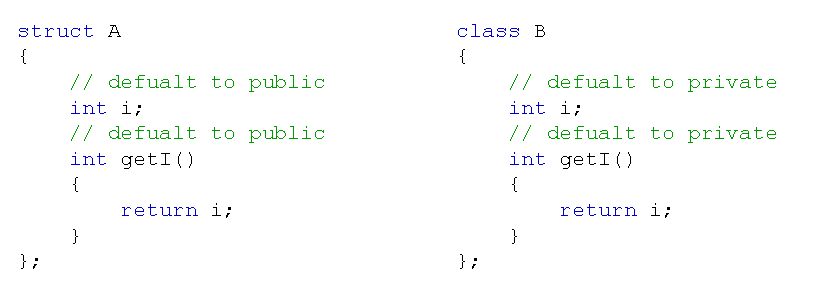

# 类的真正形态
## 类的关键字
- struct在C语言中以及有了自己的含义，必须继续兼容
- 在C++中提供了新的关键字class用于类的定义
- class和struct的用法是完全相同的
- 在用struct定义类时，所有成员的默认访问级别为public
- 在用class定义类时，所有成员的默认访问级别为private
  
  

## 类的真正形态
- C++中的类支持声明和实现的分离
- 将类的实现和定义分开
  - .h头文件中只有类的声明
    - 成员变量和成员函数的声明
  - .cpp源文件中完成类的其他实现
    - 成员函数的具体实现
  
## 小结
- C++引进了新的关键字class用于定义类
- struct和class的区别在于默认访问级别的不同
- C++中的类支持声明和实现的分离
  - 在头文件中声明类
  - 在源文件中实现类