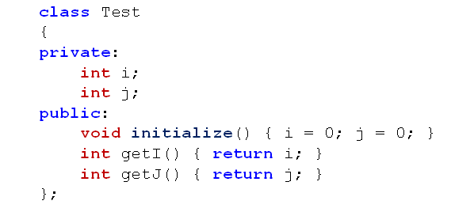

# 对象的构造(上)
## 对象的初始化
- 从程序设计的角度，对象只是变量，因此：
  - 在栈上常见对象时，成员变量初始为随机值
  - 在堆上创建对象时，成员变量初始为随机值
  - 在静态存储区创建对象时，成员变量初始为0值
- 生活中的对象都是在初始化后上市的
- 初始状态(出厂设置)是对象普遍存在的一个状态
- 一般而言，对象都需要一个确定的初始状态
- 解决方案
  - 在类中提供一个public的initialize函数
  - 对象创建后立即调用initialize函数进行初始化
  
  

- 存在的问题
  - initialize只是一个普通函数，必须显示调用
  - 如果未调用initialize函数，运行结果是不确定的
  
## 构造函数
- C++中可以定义与类名相同的特殊成员函数
  - 这种特殊的成员函数叫做构造函数
    - 构造没有任何返回类型的声明
    - 构造函数在对象定义时自动被调用

## 小结
- 每个对象在使用之前都应该初始化
- 类的构造函数用于对象的初始化
- 构造函数与类同名并且没有返回值
- 构造函数在对象定义时自动被调用