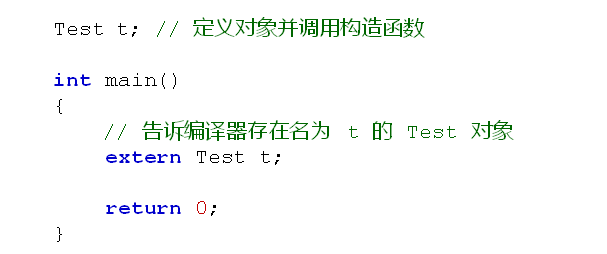

# 对象的构造(中)
## 构造函数
- 带有参数的构造函数
  - 构造函数可以根据需要定义参数
  - 一个类中可以存在多个重载的构造函数
  - 构造函数的重载遵循C++重载的规则
  
  

- 友情提醒
  - 对象定义和对象声明不同
    - 对象定义 - 申请对象空间并调用构造函数
    - 对象声明 - 告诉编译器存在这样一个对象
  
    

- 构造函数的自动调用
  
  

- 构造函数的调用
  - 一般情况下，构造函数在对象定义时被自动调用
  - 一些特殊情况下，需要手工调用构造函数
  
## 小结
- 构造函数可以根据需要定义参数
- 构造函数之间可以存在重载关系
- 构造函数遵循C++中重载函数的规则
- 对象定义时会触发构造函数的调用
- 在一些情况下可以手动调用构造函数