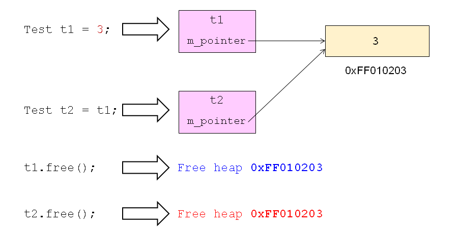

# 对象的构造(下)
## 特殊的构造函数
- 两个特殊的构造函数
  - 无参构造函数
    - 没有参数的构造函数
    - 当类中没有定义构造函数时，编译器默认提供一个无参构造函数，并且其函数体为空
  - 拷贝构造函数
    - 参数为const class_name&的构造函数
    - 当类中没有定义拷贝构造函数时，编译器默认提供一个拷贝构造函数，简单的进行成员变量的值复制
  
## 拷贝构造函数
- 拷贝构造函数的意义
  - 兼容C语言的初始化方式
  - 初始化行为能否符合预期的逻辑
  - 浅拷贝
    - 拷贝后对象的物理状态相同
  - 深拷贝
    - 拷贝后对象的逻辑状态相同
      编译器提供的拷贝构造函数只进行浅拷贝！
  - 什么时候需要进行深拷贝？
    - 对象中有成员指代了系统中的资源
      - 成员指向了动态内存空间
      - 成员打开了外存中的文件
      - 成员使用了系统中的网络端口
      - ......
  - 问题分析
  
    
  - 一般性原则
    - 自定义拷贝构造函数，必然需要实现深拷贝！！！

## 小结
- C++编译器会默认提供构造函数
- 无参构造函数用于定义对象的默认初始状态
- 拷贝构造函数在创建对象时拷贝对象的状态
- 对象的拷贝有浅拷贝和深拷贝两种方式
  - 浅拷贝使得对象的物理状态相同
  - 深拷贝使得对象的逻辑状态相同