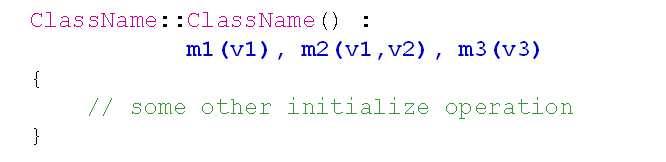

# 初始化列表的使用
## 类成员的初始化
- C++中提供了初始化列表对成员变量进行初始化
- 语法规则
  
  

- 注意事项
  - 成员的初始化顺序与成员的声明顺序相同
  - 成员的初始化顺序与初始化列表中的位置无关
  - 初始化列表先于构造函数的函数体执行

## 类中的const成员
- 类中的const成员会被分配空间的
- 类中的const成员的本质是只读变量
- 类中的const成员只能在初始化列表中指定初始值
  编译器无法直接得到const成员的初始值，因此无法进入符号表成为真正意义上的常量
- 初始化和赋值不同
  - 初始化：对正在创建的对象进行初值设置
  - 赋值：对已经存在的对象进行值设置
  
## 小结
- 类中可以使用初始化列表对成员进行初始化
- 初始化列表先于构造函数体执行
- 类中可以定义const成员变量
- const成员变量必须在初始化列表中指定初值
- const成员变量为只读变量