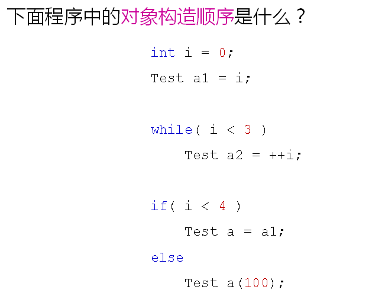
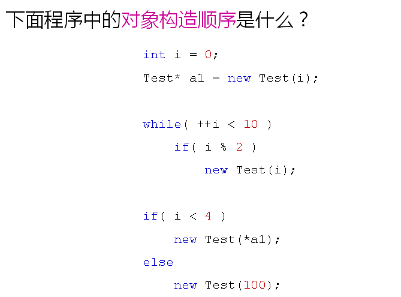

# 对象的构造顺序
## 对象的构造顺序一
- 对于局部对象
  - 当程序执行流到达对象的定义语句时进行构造
  
  

  

## 对象的构造顺序二
- 对于堆对象
  - 当程序执行流到达new语句时创建对象
  - 使用new创建对象将自动触发构造函数的调用
  
  

  
## 对象的构造顺序三
- 对于全局对象
  - 对象的构造顺序是不确定的
  - 不同的编译器使用不同的规则确定构造顺序
  
## 小结
- 局部对象的构造顺序依赖于程序的执行流
- 堆对象的构造顺序依赖于new的使用顺序
- 全局对象的构造顺序是不确定的