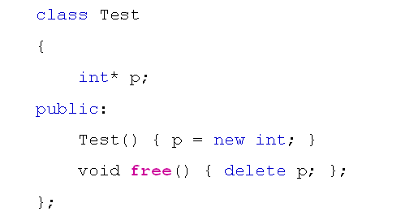

# 对象的销毁
## 对象的销毁
- 生活中的对象都是被初始化后才上市的
- 生活中的对象被销毁前会做一些清理工作
- 一般而言，需要销毁的对象都应该做清理
- 解决方案
  - 为每个类都提供一个public的free函数
  - 对象不在需要时立即调用free函数进行清理
  
  

- 存在的问题
  - free只是一个普通的函数，必须显示的调用
  - 对象销毁前没有做清理，很可能造成资源泄漏
  
## 析构函数
- C++的类中可以定义一个特殊的清理函数
  - 这个特殊的清理函数叫做析构函数
  - 析构函数的功能与构造函数相反
- 定义：~ClassName
  - 析构函数没有参数也没有返回值类型声明
  - 析构函数在对象销毁时自动被调用
- 析构函数的定义准则
  当类中自定义了构造函数，并且构造函数中使用了系统资源(如：内存申请，文件打开等)，则需要自定义析构函数

## 小结
- 析构函数是对象销毁时进行清理的特殊函数
- 析构函数在对象销毁时自动被调用
- 析构函数是对象释放系统资源的保障