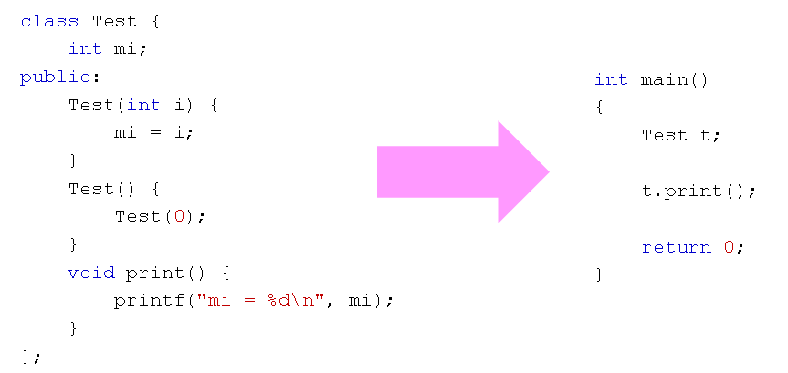

# 神秘的临时对象
## 有趣的问题
- 下面的程序输出是什么？为什么？
  
  

## 发生了什么？
- 程序意图：
  - 在Test()中以0作为参数调用Test(int i)
  - 将成员变量mi的初始值设置为0
- 运行结果：
  - 成员变量mi的值为随机值
  
## 思考
- 构造函数是一个特殊的函数
  - 是否可以直接调用？
  - 是否可以在构造函数中调用构造函数？
  - 直接调用构造函数的行为是什么？
  
## 答案
- 直接调用构造函数将产生一个临时对象
- 临时对象的生命周期只有一条语句的时间
- 临时对象的作用域只在一条语句中
- 临时对象时C++中值得警惕的灰色地带
  
## 编译器的行为 
现代C++编译器在不影响最终执行结果的前提下，会尽力减少临时对象的产生！！！

## 小结
- 直接调用构造函数将产生一个临时对象
- 临时对象是性能的瓶颈，也是bug的来源之一
- 现代C++编译器会尽力避开临时对象
- 实际工程开发中需要认为的避开临时对象