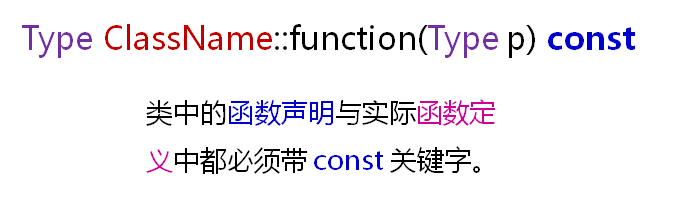

# 经典问题解析二
## 关于析构的疑问
- 当程序中存在多个对象的时候，如何确定这些对象的析构顺序？
- 单个对象创建时构造函数的调用顺序
  - 1.调用父类的构造过程
  - 2.调用成员变量的构造函数(调用顺序于声明顺序相同)
  - 调用类自身的构造函数
    析构函数与对应的构造函数的调用顺序相反
- 多个对象析构时
  - 析构顺序与构造顺序相反
  
## 关于析构的答案
对于栈对象和全局对象，类似于入栈与出栈的顺序，最后构造的对象被最先析构！！
堆对象的析构发生在使用delete的时候，与delete的使用顺序相关

## 关于const对象的疑问
- const关键字能够修饰对象
- const修饰的对象为只读对象
- 只读对象的成员变量不允许被改变
- 只读对象是编译阶段的概念，运行时无效
- C++中的const成员函数
  - const对象只能调用const的成员函数
  - const成员函数中只能调用const成员函数
  - const成员函数中不能直接改写成员变量的值
- const成员函数的定义
  
  

## 关于类成员的疑问
- 从面相对象的角度
  - 对象由属性(成员变量)和方法(成员函数)构成
- 从程序运行的角度
  - 对象由数据和函数构成
    - 数据可以位于栈、堆和全局数据区
    - 函数只能位于代码段
- 结论
  - 每一个对象拥有自己独立的属性(成员变量)
  - 所有的对象共享类的方法(成员函数)
  - 方法能够直接访问对象的属性
  - 方法中的隐藏参数this用于指代当前对象