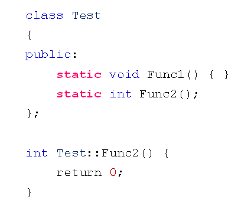
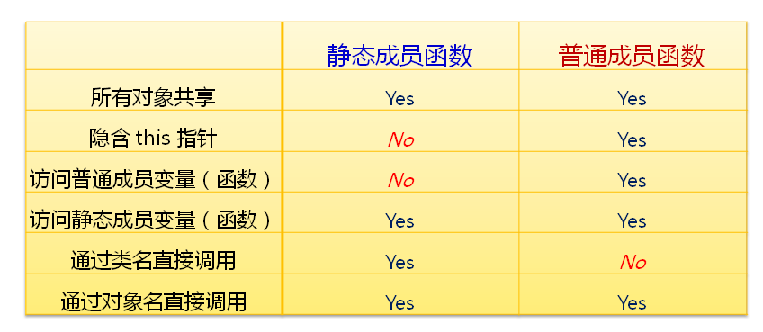

# 类的静态成员函数
## 静态成员函数
- 在C++中可以定义静态成员函数
  - 静态成员函数是类中特殊的成员函数
  - 静态成员函数属于整个类所有
  - 可以通过类名直接访问公有静态成员函数
  - 可以通过对象名访问公有静态成员函数
- 静态成员函数的定义
  - 直接通过static关键字修饰成员函数
  
  

- 静态成员函数 vs 普通成员函数
  
  

## 小结
- 静态成员函数是类中特殊的成员函数
- 静态成员函数没有隐藏的this参数
- 静态成员函数可以通过类名直接访问
- 静态成员函数只能直接访问静态成员变量(函数)