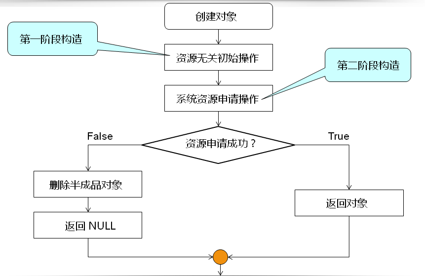
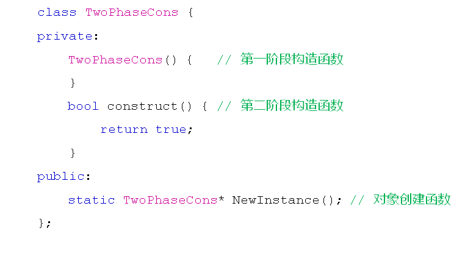
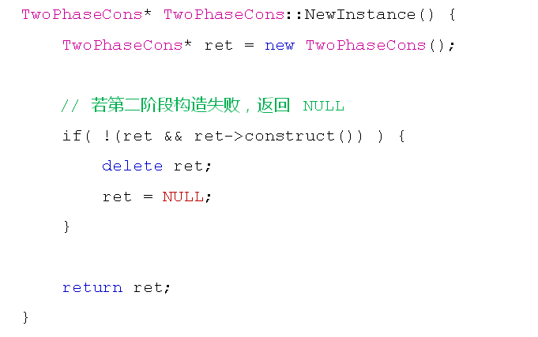

# 二阶构造模式
## 构造函数的回顾
- 关于构造函数
  - 类的构造函数用于对象的初始化
  - 构造函数与类同名并且没有返回值
  - 构造函数在对象定义时自动被调用
  
## 你该知道的真相
- 构造函数
  - 只提供自动初始化成员变量的机会
  - 不能保证初始化逻辑一定成功
  - 执行return语句后构造函数立即结束
  构造函数能决定的只是对象的初始状态，而不是对象的诞生

## 半成品对象
- 半成品对象的概念
  - 初始化操作不能按照预期完成而得到的对象
  - 半成品对象时合法的C++对象，也是bug的重要来源
  
## 二阶构造
- 工程开发中的构造过程可分为
  - 资源无关的初始化操作
    - 不可能出现异常情况的操作
  - 需要使用系统资源的操作
    - 可能出现异常情况，如内存申请，访问文件等
  
  

- 二阶构造示例一
  
  

- 二阶构造示例二
  
  

## 小结
- 构造函数只能决定对象的初始化状态
- 构造函数中初始化操作的失败不影响对象的诞生
- 初始化不完全的半成品对象是bug的重要来源
- 二阶构造人为的将初始化过程分为两部分
- 二阶构造能够确保创建的对象都是完整初始化的