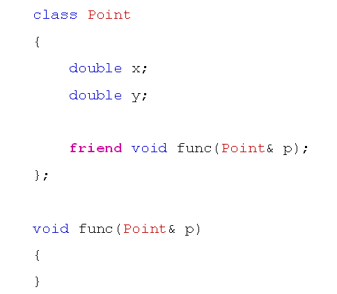

# 友元的尴尬能力
## 友元的概念
- 什么是友元？
  - 友元是C++中的一种关系
  - 友元关系发生在函数与类之间或者类与类之间
  - 友元关系是单项的，不能传递

## 友元的用法
- 在类中以friend关键字声明友元
- 类的友元可以是其他类或者具体函数
- 友元不是类的一部分
- 友元不受类中访问级别的限制
- 友元可以直接访问具体类的所有成员
  
## 友元的语法
- 在类中用friend关键字对函数或类进行声明
  
  

## 友元的尴尬
- 友元是为了兼顾C语言的高效而诞生的
- 友元直接破坏了面向对象的封装性
- 友元在实际产品中的高效是得不偿失的
- 友元在现代软件工程中已经逐渐被遗弃
  
## 注意事项
- 友元关系不具备传递性
- 类的友元可以是其他类的成员函数
- 类的友元可以是某个完整的类
  - 所有的成员函数都是友元
  
  

## 小结
- 友元是为了兼顾C语言的高效而诞生的
- 友元直接破坏了面向对象的封装性
- 友元关系不具备传递性
- 类的友元可以是其他类的成员函数
- 类的友元可以是某个完整的类