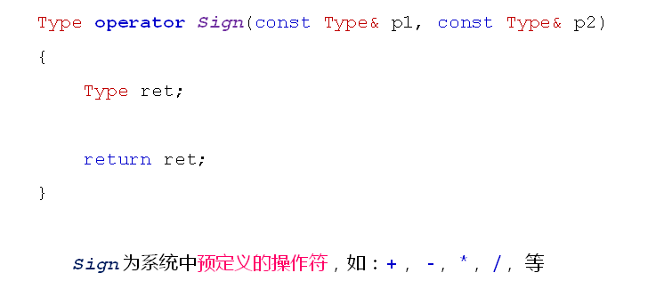
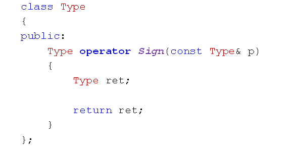

# 操作符重载的概念
## 操作符重载
- C++中的重载能够扩展操作符的功能
- 操作符的重载以函数的方式进行
- 本质：
  - 用特殊形式的函数扩展操作符的功能
- 通过operator关键字可以定义特殊的函数
- operator的本质是通过函数重载操作符
- 语法：
  
  

- 可以将操作符重载函数定义为类的成员函数
  - 比全局操作符重载函数少一个参数(左操作数)
  - 不需要依赖友元就可以完成操作符重载
  - 编译器优先在成员函数中寻找操作符重载函数
  
  

## 小结
- 操作符重载是C++的强大特性之一
- 操作符重载的本质是通过函数扩展操作符的功能
- operator关键字是实现操作符重载的关键
- 操作符重载遵循相同的函数重载规则
- 全局函数和成员函数都可以实现对操作符的重载