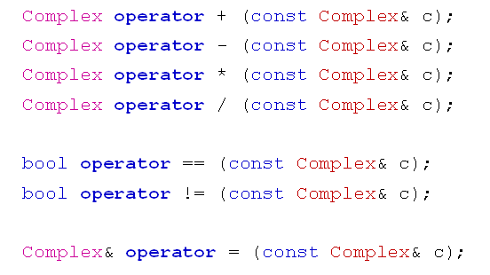

# 完善的复数类
## 完善的复数类
- 复数类应该具有的操作
  - 运算：+，-，*，/
  - 比较：==，!=
  - 赋值：=
  - 求模：modulus
- 利用操作符重载
  - 统一复数与实数的运算方式
  - 统一复数与实数的比较方式
  
  

## 注意事项
- C++规定赋值操作符(=)只能重载为成员函数
- 操作符重载不能改变原操作符的优先级
- 操作符重载不能改变操作数的个数
- 操作符重载不应改变操作符的原有语义
  
## 小结
- 复数的概念可以通过自定义类实现
- 复数中运算操作可以通过操作符重载实现
- 赋值操作符只能通过成员函数实现
- 操作符重载的本质为函数定义