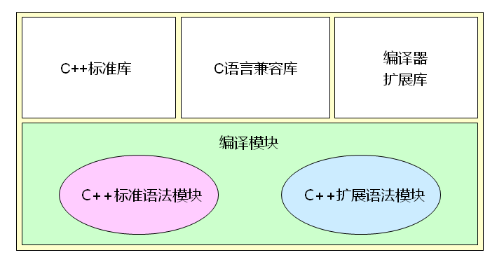
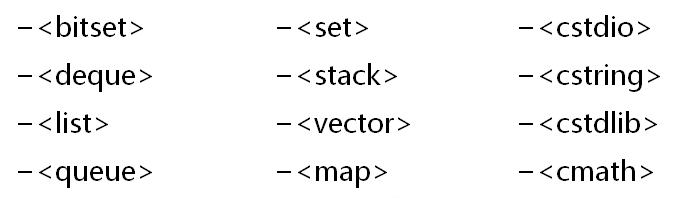
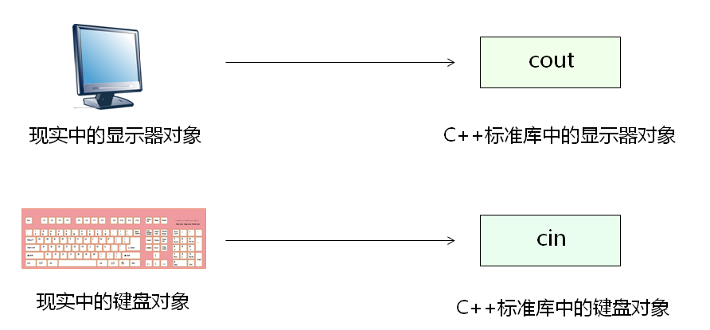

# 初探C++标准库
## C++标准库
- C++标准库并不是C++语言的一部分
- C++标准库是由类库和函数库组成的集合
- C++标准库中定义的类和对象都位于std命名空间中
- C++标准库的头文件都不带.h后缀
- C++标准库涵盖了C库的功能
- C++编译环境的组成

  

- C++标准库预定义了多数常用的数据结构
  
  

  

## 小结
- C++标准库是由类库和函数库组成的集合
- C++标准库包含经典算法和数据结构的实现
- C++标准库涵盖了C库的功能
- C++标准库位于std命名空间中