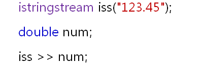
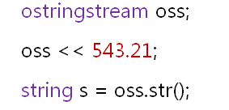

# C++中的字符串类
## 历史遗留问题
- C语言不支持真正意义上的字符串
- C语言用字符数组和一组函数实现字符串操作
- C语言不支持自定义类型，因此无法获得字符串类型
  
## 解决方案
- 从C到C++的进化过程引入自定义类型
- 在C++中可以通过类完成字符串类型的定义
  
## 标准库中的字符串类
- C++语言直接支持C语言的所有概念
- C++语言中没有原生的字符串类型
- C++标准库提供了string类型
  - string直接支持字符串连接
  - string直接支持字符串大小比较
  - string直接支持子串查找和提取
  - string直接支持字符串的插入和替换
- 字符串与数字的转换
  - 标准库中提供了相关的类对字符串和数字进行转换
  - 字符串流类(sstream)用于string的转换
    - \<sstream\> - 相关头文件
    - istringstream - 字符输入流
    - ostringstream - 字符输出流
- 使用方法
  - string -> 数字
  
  

  - 数字 -> string
  
  

## 小结
- 应用开发中大多数情况都在进行字符串处理
- C++中没有直接支持原生的字符串类型
- 标准库中通过string类支持字符串的概念
- string类支持字符串和数字的相互转换
- string类的应用是的问题的求解变得简单