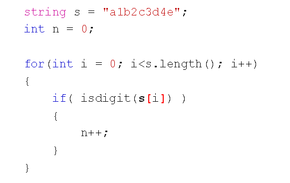
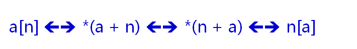

# 数组操作符的重载
## 字符串类的兼容性
- string类最大限度的考虑了C字符串的兼容性
- 可以按照使用C字符串的方式使用string对象
  
  

## 重载数组访问操作符
- 被忽略的事实。。。
  - 数组访问操作符是C/C++中的内置操作符
  - 数组访问操作符的原生意义是数组访问和指针运算
  
  

- 数组访问操作符([])
  - 只能通过类的成员函数重载
  - 重载函数能且仅能使用一个参数
  - 可以定义不同参数的多个重载函数
  
## 小结
- string类最大程度的兼容了C字符串的用法
- 数组访问操作符的重载能够使得对象模拟数组的行为
- 只能通过类的成员函数重载数组访问操作符
- 重载函数能且仅能使用一个参数