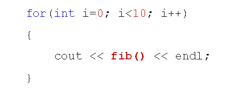

# 函数对象分析
## 客户需求
- 编写一个函数
  - 函数可以获得斐波那契数列每项的值
  - 每调用一次返回一个值
  - 函数可根据需要重复使用
  
  

## 存在的问题
- 函数一旦开始调用就无法重来
  - 静态局部变量处于函数内部，外界无法改变
  - 函数为全局函数，是唯一的，无法多次独立使用
  - 无法指定某个具体的数列项作为初始值
  
## 解决方案
- 函数对象
  - 使用具体的类对象取代函数
  - 该类的对象具备函数调用的行为
  - 构造函数指定具体数列项的起始位置
  - 多个对象相互独立的求解数列项
  
## 函数对象
- 函数调用操作符(())
  - 只能通过类的成员函数重载
  - 可以定义不同参数的多个重载函数
  
## 小结
- 函数调用操作符(())是可重载的
- 函数调用操作符只能通过类的成员函数重载
- 函数调用操作符可以定义不同参数的多个重载函数
- 函数对象用于在工程中取代函数指针