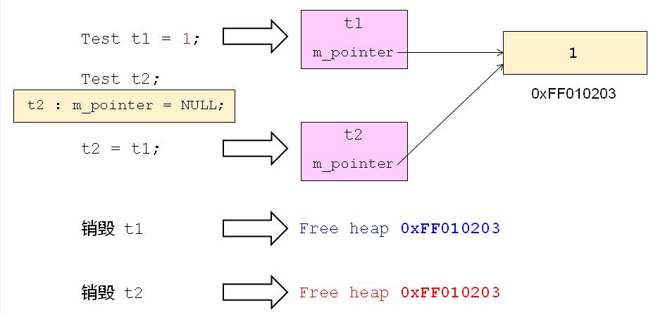
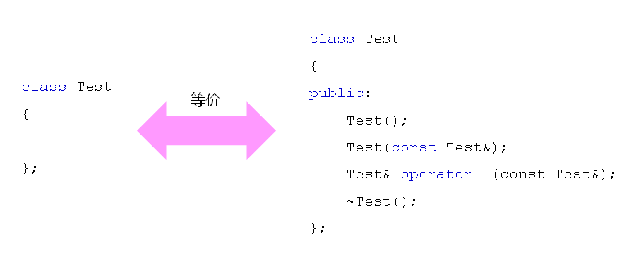
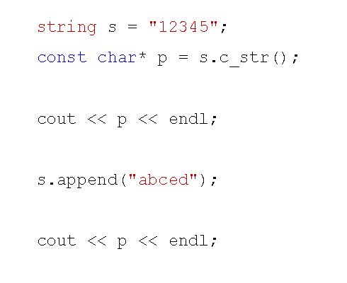
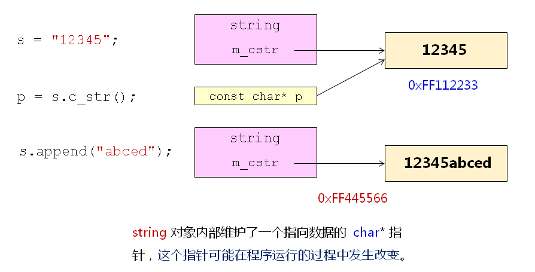
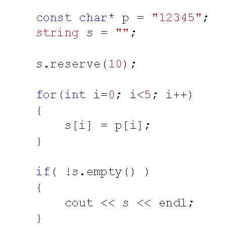
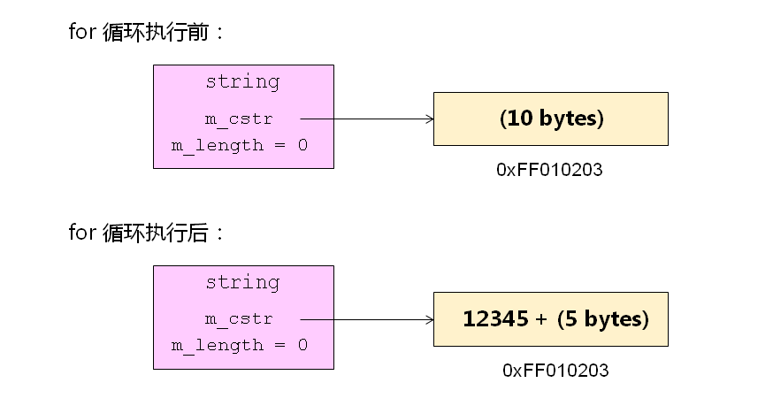

# 经典问题解析三
## 关于赋值的疑问
- 什么时候需要重载赋值操作符？编译器是否提供默认的赋值操作？
- 编译器为每个类默认重载了赋值操作符
- 默认的赋值操作符仅完成浅拷贝
- 当需要进行深拷贝时必须重载赋值操作符
- 赋值操作符与拷贝构造函数有相同的存在意义
- 问题分析
  
  

- 一般性原则
  重载赋值操作符，必然需要实现深拷贝！！！

## 不积跬步无以至千里
- 编译器默认提供的函数
  
  

## 关于string的疑问
- 下面的代码输出什么？为什么？
  
  

- 问题分析
  
  

- 下面的代码输出什么？为什么？
  
  

- 问题分析
  
  

## 小结
- 在需要进行深拷贝的时候必须重载赋值操作符
- 赋值操作符和拷贝构造函数有同等重要的意义
- string类通过一个数据空间保存字符数据
- string类通过一个成员变量保存当前字符串的长度
- C++开发时尽量避开C语言中惯用的编程思想