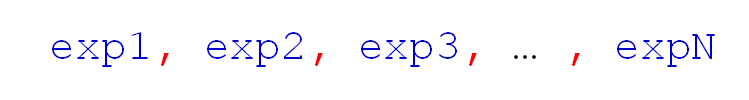
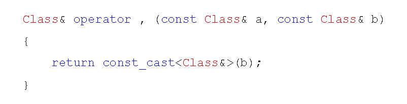

# 逗号操作符的分析
## 逗号操作符
- 逗号操作符(,)可以构成逗号表达式
  - 逗号表达式用于将多个子表达式连接成为一个表达式
  - 逗号表达式的值为最后一个子表达式的值
  - 逗号表达式中的前N-1个子表达式可以没有返回值
  - 逗号表达式按照从左向右的顺序计算每个子表达式的值
  
  

## 重载逗号操作符
- 在C++中重载逗号操作符是合法的
- 使用全局函数对逗号操作符进行重载
- 重载函数的参数必须有一个是类类型
- 重载函数的返回值类型必须是引用
  
  

- 问题的本质分析
  - 1. C++通过函数调用扩展操作符的功能
  - 2. 进入函数体前必须完成所有参数的计算
  - 3. 函数参数的计算次序是不定的
  - 4. 重载后无法严格从左向右计算表达式
  工程中不要重载逗号操作符！！

## 小结
- 逗号表达式从左往右顺序计算每个子表达式的值
- 逗号表达式的值为最后一个子表达式的值
- 操作符重载无法完全实现逗号操作符的原生意义
- 工程开发中不要重载逗号操作符