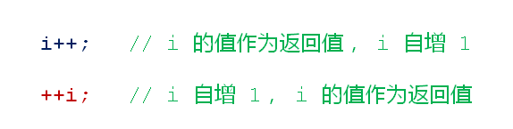

# 前置操作符和后置操作符
## 下面的代码有没有区别？为什么？

## 意想不到的事实
- 现代编译器产品会对代码进行优化
- 优化使得最终的二进制程序更加高效
- 优化后二进制程序丢失了C/C++的原生语义
- 不可能从编译后的二进制程序还原C/C++程序
  
## ++操作符重载
- ++操作符可以被重载
  - 全局函数和成员函数均可进行重载
  - 重载前置++操作符不需要额外的参数
  - 重载后置++操作符需要一个int类型的占位参数
  
## 真正的区别
- 对于基础类型的变量
  - 前置++的效率和后置++的效率基本相同
  - 根据项目组编码规范进行选择
- 对于类类型的对象
  - 前置++的效率高于后置++
  - 尽量使用前置++操作符提高程序效率
  
### 小结
- 编译优化使得最终的可执行程序更加高效
- 前置++操作符和后置++操作符都可以被重载
- ++操作符的重载必须符合其原生语义
- 对于基础类型，前置++与后置++的效率几乎相同
- 对于类类型，前置++的效率高于后置++