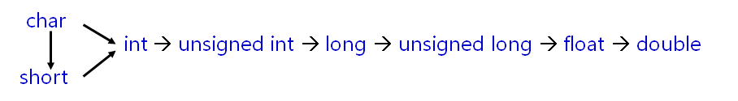
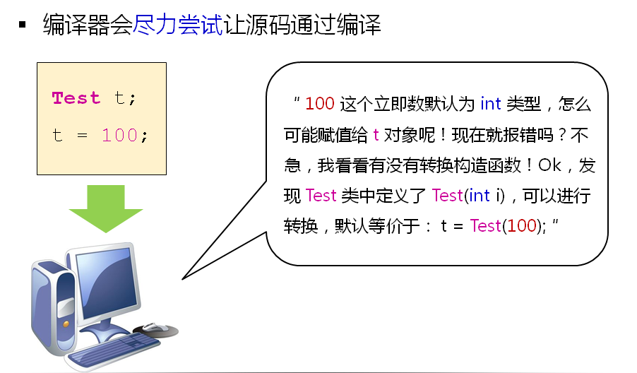

# 类型转换函数(上)
## 再论类型转换
- 标准数据类型之间会进行隐式的类型安全转换
- 转换规则如下:

  

## 问题
普通类型与类类型之间能否进行类型转换？
类类型之间能否进行类型转换

## 再论构造函数
- 构造函数可以定义不同类型的参数
- 参数满足下列条件时称为转换构造函数
  - 有且仅有一个参数
  - 参数是基本类型
  - 参数是其他类类型
  
## 编译器的行为

- 编译器尽力尝试的结果是隐式类型转换
- 隐式类型转换
  - 会让程序以意想不到的方式进行工作
  - 是工程中bug的重要来源
- 工程中通过explicit关键字杜绝编译器的转换尝试
- 转换构造函数被explicit修饰时只能进行显示转换
  - 转换方式
    - static_caseClassName(value);
    - ClassName(value);
    - (ClassName)value; // 不推荐
  
## 小结
- 转换构造函数只有一个参数
- 转换构造函数的参数类型是其他类型
- 转换构造函数在类型转换时被调用
- 隐式类型转换时工程中bug的重要来源
- explicit关键字用于杜绝隐式类型转换