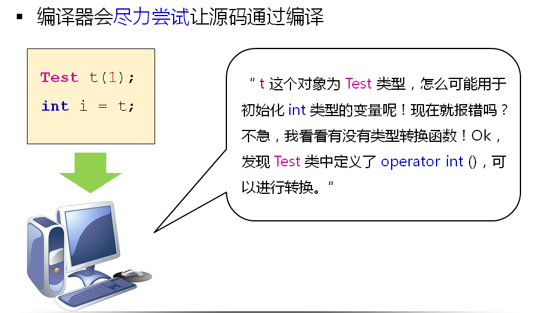

# 类型转换函数(下)
## 类型转换函数
- C++类中可以定义类型转换函数
- 类型转换函数用于将类对象转换成其他类型
- 语法规则：

  

- 类型转换函数
  - 与转换构造函数具有同等的地位
  - 使得编译器有能力将对象转换为其他类型
  - 编译器能够隐式的使用类型转换函数

- 无法抑制隐式的类型转换函数调用
- 类型转换函数可能与转换构造函数冲突
- 工程中以Type toType()的公有成员函代替类型转换函数
  
## 小结
- C++类中可以定义类型转换函数
- 类型转换函数用于将类对象转换为其他类型
- 类型转换函数与转换构造函数具有同等的地位
- 工程中以Type toType()的公有成员函代替类型转换函数