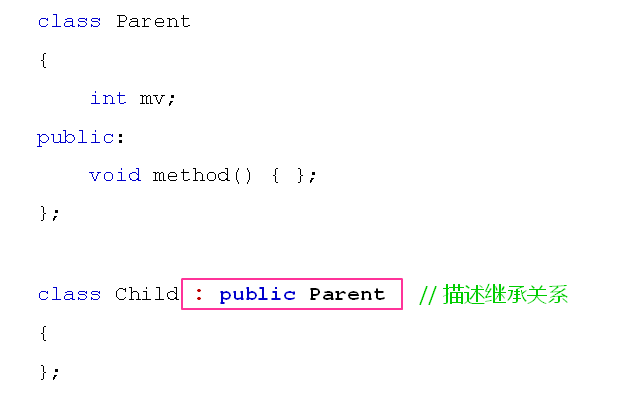

# 继承的概念和意义
## 类之间的组合关系
- 组合关系的特点
  - 将其他类的对象作为当前类的成员使用
  - 当前类的对象与成员对象的生命期相同
  - 成员对象在用法上与普通对象完全一致
  
## 惊艳的继承
- 面相对象中的继承指类之间的父子关系
  - 子类拥有父类的所有属性和行为
  - 子类就是一种特殊的父类
  - 子类对象可以当做父类对象使用
  - 子类中可以添加父类没有的方法和属性
- C++中通过下面的方式描述继承关系
  
  

- 重要准则
  - 子类就是一个特殊的父类
  - 子类对象可以直接初始化父类对象
  - 子类对象可以直接赋值给父类对象

## 继承的意义
继承是C++中代码复用的重要手段。通过继承，可以获得父类的所有功能，并且可以在子类中重写已有的功能，或者添加新的功能

## 小结
- 继承是面相对象中类之间的一种关系
- 子类拥有父类的所有属性和行为
- 子类对象可以当做父类对象使用
- 子类中可以添加父类没有的方法和属性
- 继承是面向对象中代码复用的重要手段