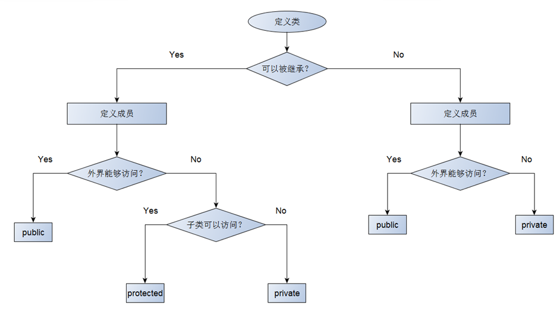

# 继承中的访问级别
## 继承中的访问级别
- 面向对象中的访问级别不只是public和private
- 可以定义protected访问级别
- 关键字protected的意义
  - 修饰的成员不能被外界直接访问
  - 修饰的成员可以被子类直接访问
  
## 定义类时访问级别的选择

## 小结
- 面向对象中的访问级别不只是public和private
- protected修饰的成员不能被外界所访问
- protected使得子类能够访问父类的成员
- protected关键字是为了继承而专门设计的
- 没有protected就无法完成真正意义上的代码复用