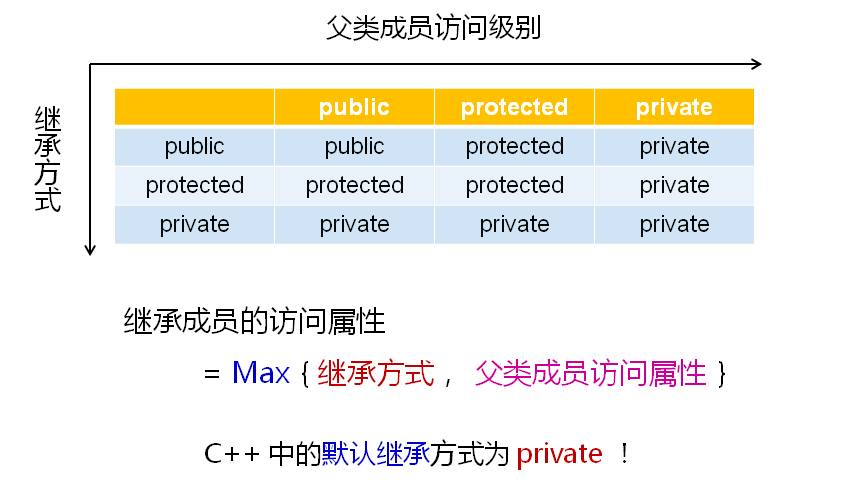

# 不同的继承方式
## 不同的继承方式
- C++中支持三种不同的继承方式
  - public继承
    - 父类成员在子类中保持原有的访问级别
  - private继承
    - 父类成员在子类中变为私有成员
  - protected继承
    - 父类中公有成员变为保护成员，其他成员保持不变
  

## 遗憾的事实
- 一般而言，C++工程项目中只使用public继承
- C++的派生语言只支持一种继承方式(public继承)
- protected和private继承带来的复杂性远大于实用性

## 小结
- C++中支持3种不同的继承方式
- 继承方式直接影响父类成员在子类中的访问属性
- 一般而言，工程中只使用public的继承方式
- C++的派生语言中只支持public继承方式