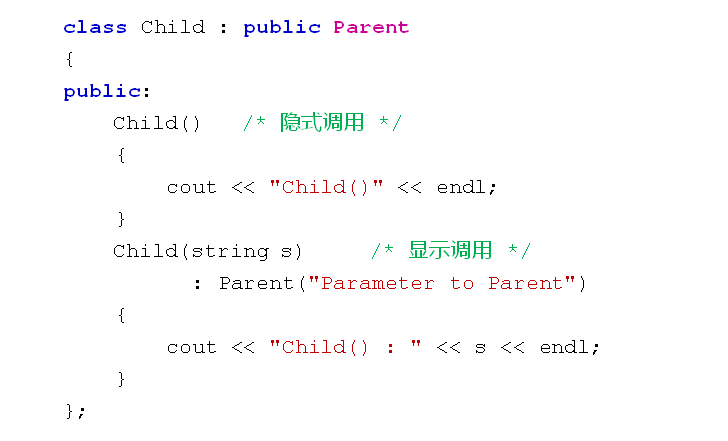

# 继承中的构造与析构
## 子类对象的构造
- 子类中可以定义构造函数
- 子类构造函数
  - 必须对继承而来的成员进行初始化
    - 直接通过初始化列表或者赋值的方式进行初始化
    - 调用父类构造函数进行初始化
- 父类构造函数在子类中的调用方式
  - 默认调用
    - 适用于无参构造函数和使用默认参数的构造函数
  - 显示调用
    - 通过初始化列表进行调用
    - 适用于所有父类构造函数
- 父类构造函数的调用
  
  

## 子类对象的构造
- 构造规则
  - 子类对象在创建时会首先调用父类的构造函数
  - 先执行父类构造函数再执行子类的构造函数
  - 父类构造函数可以被隐式调用或者显示调用
- 对象创建时构造函数的调用顺序
  - 1. 调用父类的构造函数
  - 2. 调用成员变量的构造函数
  - 3. 调用类自身的构造函数
  口诀心法：
  先父母，后客人，再自己

## 子类对象的析构
- 析构函数的调用顺序于构造函数想法
  - 1. 执行自身的析构函数
  - 2. 执行成员变量的析构函数
  - 3. 执行父类的析构函数

## 小结
- 子类对象在创建时需要调用父类构造函数进行初始化
- 先执行父类构造函数然后执行成员的构造函数
- 父类构造函数显示调用需要再初始化列表中进行
- 子类对象在销毁时需要调用父类析构函数进行处理
- 析构顺序与构造顺序对称相反