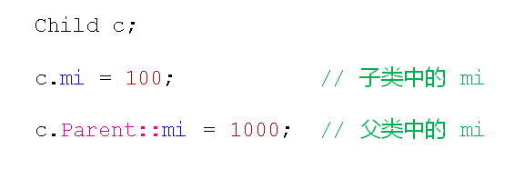

# 父子间的冲突
## 父子间的冲突
- 子类可以定义父类中的同名成员
- 子类中的成员将隐藏父类中的同名成员
- 父类中的同名成员依然存在于子类中
- 通过作用域分辨符(::)访问父类中的同名成员
- 访问父类中的同名成员

## 再论重载
- 类中的成员函数可以进行重载
  - 1. 重载函数的本质为多个不同的函数
  - 2. 函数名和参数列表是唯一的标识
  - 3. 函数重载必须发生在同一个作用域中
  
## 父子间的冲突
- 子类中的函数将隐藏父类的同名函数
- 子类无法重载父类中的成员函数
- 使用static_case访问父类中的同名函数
- 子类可以定义父类中完全相同的成员函数
  
## 小结
- 子类可以定义父类中的同名成员
- 子类中的成员将隐藏父类中的同名成员
- 子类和父类中的函数不能构成重载关系
- 子类可以定义父类中完全相同的成员函数
- 使用作用域分辨符访问父类中的同名成员