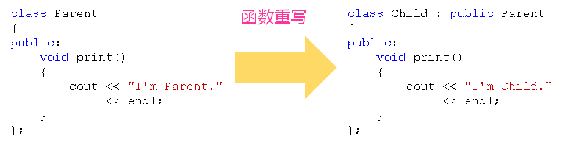
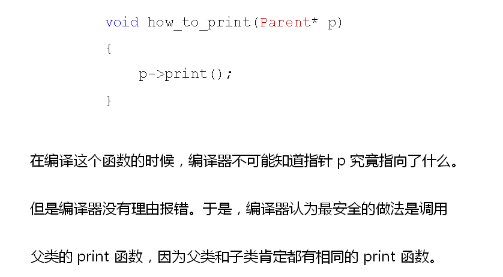

# 同名覆盖引发的问题
## 父子间的赋值兼容
- 子类对象可以当做父类对象使用(兼容性)
  - 子类对象可以直接赋值给父类对象(兼容性)
  - 子类对象可以直接初始化父类对象
  - 父类指针可以直接指向子类对象
  - 父类引用可以直接引用子类对象
- 当使用父类指针(引用)指向子类对象时
  - 子类对象退化为父类对象
  - 只能访问父类中定义的成员
  - 可以直接访问被子类覆盖的同名成员
  
## 特殊的同名函数
- 子类中可以重定义父类中已经存在的成员函数
- 这种重定义发生在继承中，叫做函数重写
- static_case是同名覆盖的一种特殊情况
  
  

- 问题分析：函数重写遇上赋值兼容会发生什么？
  - 编译期间，编译器只能根据指针的类型判断所指向的对象
  - 根据赋值兼容，编译器认为父类指针指向的是父类对象
  - 因此，编译结果只可能是调用父类中定义的同名函数
  
  

## 小结
- 子类对象可以当做父类对象使用(赋值兼容)  
- 父类指针可以正确的指向子类对象
- 父类引用可以正确的代表子类对象
- 子类中可以重写父类中的成员函数