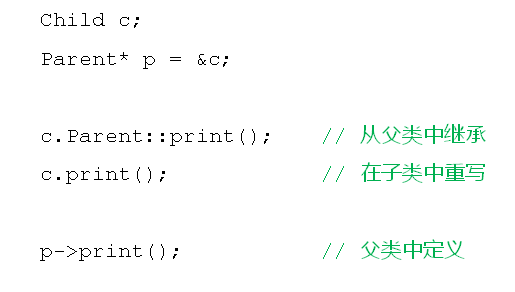
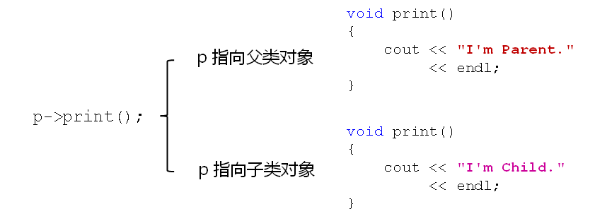

# 多态的概念和意义
## 函数重写回顾
- 父类中被重写的函数依然会继承给子类
- 子类中重写的函数将覆盖父类中的函数
- 通过作用域分辨符(::)访问父类中的同名成员
  
  

## 多态的概念和意义
- 面向对象中期望的行为
  - 根据实际的对象类型判断如何调用重写函数
  - 父类指针(引用)指向
    - 父类对象则调用父类中定义的函数
    - 子类对象则调用子类中定义的重写函数
- 面向对象中的多态的概念
  - 根据实际的对象类型决定函数调用的具体目标
  - 同样的调用语句在实际运行时有多种不同的表现形态
  
  

- C++语言直接支持多态的概念
  - 通过使用virtual关键字对多态进行支持
  - 被virtual声明的函数被重写后具有多态特性
  - 被virtual声明的函数叫做虚函数
- 多态的意义
  - 在程序运行过程中展现出动态的特性
  - 函数重写必须多态实现，否则没有意义
  - 多态是面向对象组件化程序设计的基础特性
- 理论中的概念
  - 静态联编
    - 在程序的编译期间就能确定具体的函数调用
      - [X] 如：函数重载
  - 动态联编
    - 在程序实际运行后才能确定具体的函数调用
      - [x] 如：函数重写

## 小结
- 函数重写只可能发生在父类与子类之间
- 根据实际对象的类型确定调用的具体函数
- virtual关键字是C++中支持多态的唯一方式
- 被重写的虚函数可表现出多态的特性