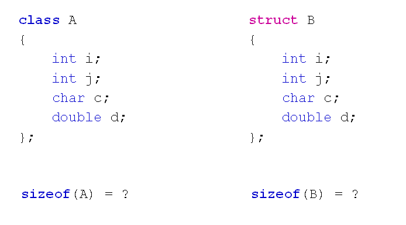

# C++对象模型分析(上)
## 回归本质
- class是一种特殊的struct
  - 在内存中class依旧可以看做变量的集合
  - class和struct遵循相同的内存对齐规则
  - class中的成员函数与成员变量是分开存放的
    - 每个对象有独立的成员变量
    - 所有对象共享类中的成员函数
- 值得思考的问题
  
  

## C++对象模型分析
- 运行时的对象退化为结构体的形式
  - 所有成员变量在内存中依次排布
  - 成员变量间可能存在内存空隙
  - 可以通过内存地址直接访问成员变量
  - 访问权限关键字在运行时失效
- 类中的成员函数位于代码段中
- 调用成员函数时对象地址作为参数隐式传递
- 成员函数通过对象地址访问成员变量
- C++语法规则隐藏了对象地址的传递过程
  
## 小结
- C++中的类对象在内存布局上与结构体相同
- 成员变量和成员函数在内存中分开存放
- 访问权限关键字在运行时失效
- 调用成员函数时对象地址作为参数隐式传递