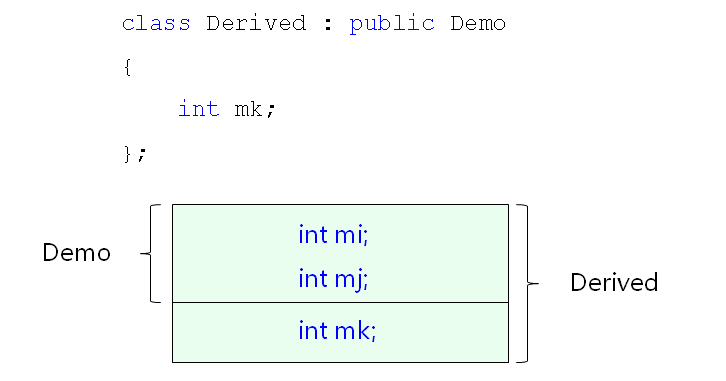
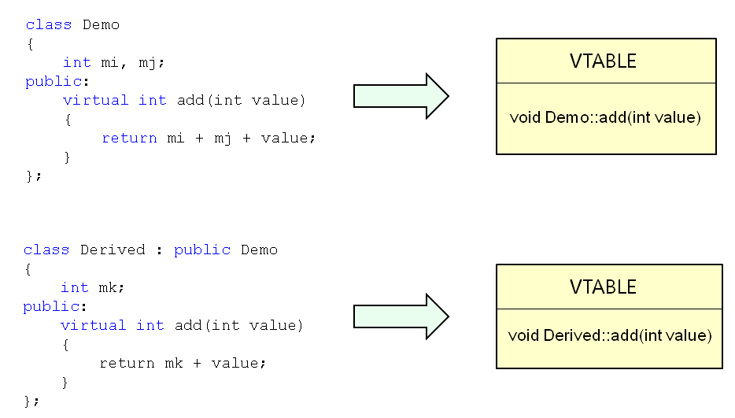
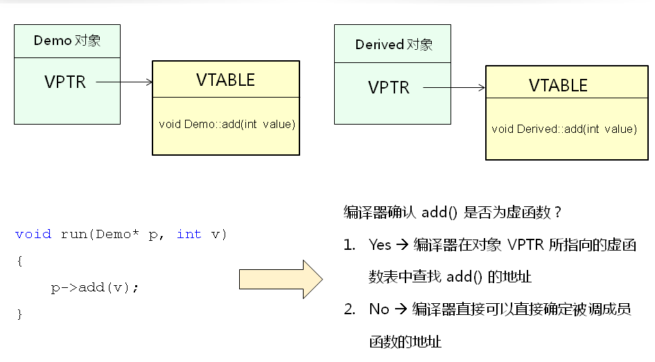
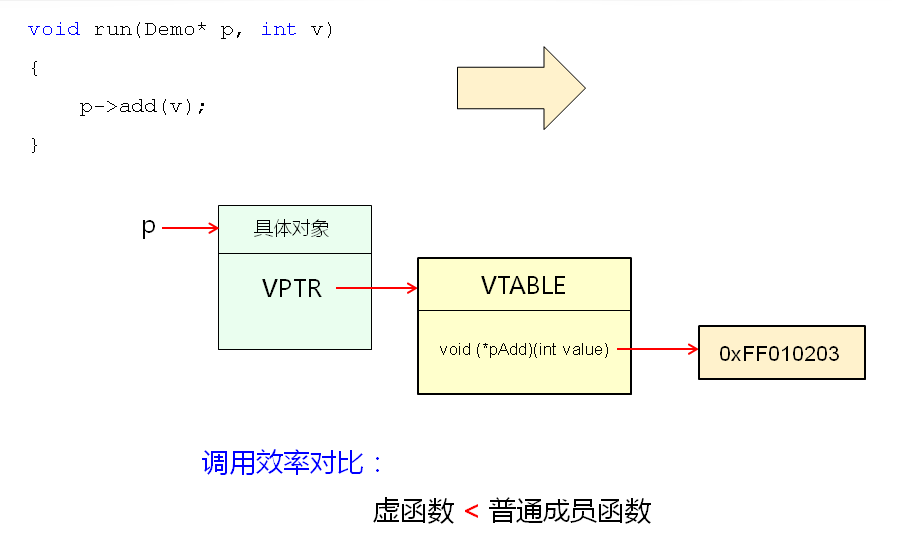

# C++对象模型分析(下)
## 继承对象模型
- 在C++中编译器的内部类可以理解为结构体
- 子类是由父类成员叠加子类新成员得到的
  
  

## 多态对象模型
- C++多态的实现原理
  - 当类中声明虚函数时，编译器会在类中生成一个虚函数表
  - 虚函数表示一个存储成员函数地址的数据结构
  - 虚函数表是由编译器自动生成与维护的
  - virtual成员函数会被编译器放入虚函数表中
  - 存在虚函数时，每个对象中都有一个指向虚函数表的指针
  
  

  

  

## 小结
- 继承的本质就是父子间成员变量的叠加
- C++中的多态是通过虚函数表实现的
- 虚函数表是由编译器自动生成与维护的
- 虚函数的调用效率低于普通成员函数