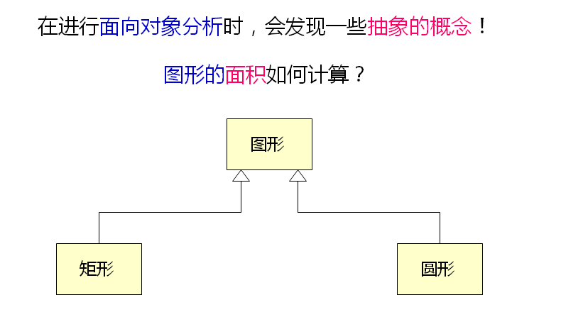
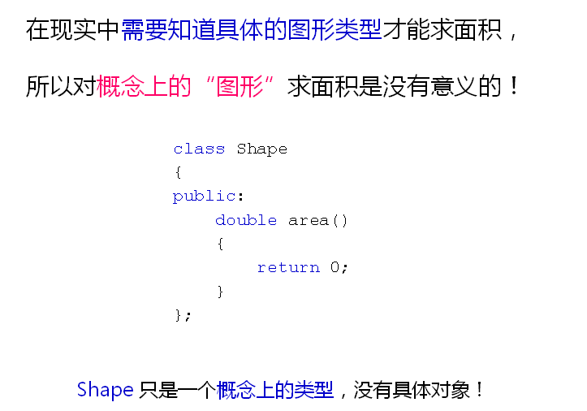
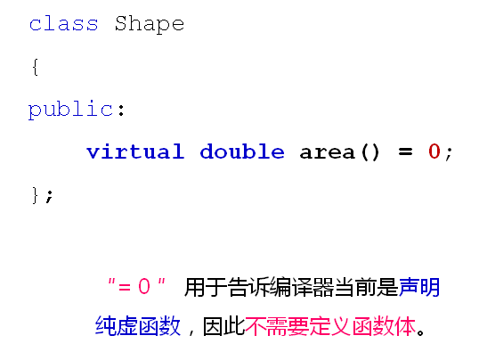

# C++中的抽象类和接口
## 什么是抽象类？
- 面相对象中的抽象概念
  
  

  

- 面向对象中的抽象类
  - 可用于表现现实世界中的抽象概念
  - 是一种只能定义类型，而不能产生对象的类
  - 只能被继承并重写相关函数
  - 直接特征是相关函数没有完整的实现
- Shape是现实世界中各种图形的抽象概念
- 因此：
  - 程序中必须能够反映抽象的图形
  - 程序中通过抽象类表示图形的概念
  - 抽象类不能创建对象，只能用于继承
  
## 抽象类与纯虚函数
- C++语言中没有抽象类的概念
- C++中通过纯虚函数实现抽象类
- 纯虚函数是指只定义原型的成员函数
- 一个C++类中存在纯虚函数就成为了抽象类
- 纯虚函数的语法规则
  
  

- 抽象类只能用作父类被继承
- 子类必须实现纯虚函数的具体功能
- 纯虚函数被实现后成为虚函数
- 如果子类没有实现纯虚函数，则子类成为抽象类
- 满足下面条件的C++类则称为接口
  - 类中没有定义任何的成员变量
  - 所有的成员函数都是公有的
  - 所有的成员函数都是纯虚函数
  - 接口是一种特殊的抽象类

## 小结
- 抽象类用于描述现实世界中的抽象概念
- 抽象类只能被继承不能创建对象
- C++中没有抽象类的概念
- C++中通过纯虚函数实现抽象类
- 类中只存在纯虚函数时成为接口
- 接口是一种特殊的抽象类