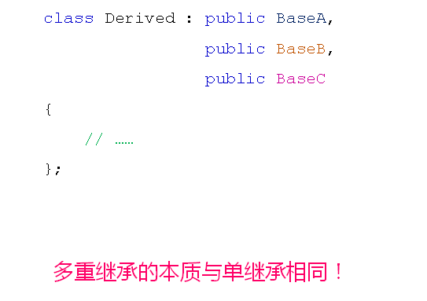
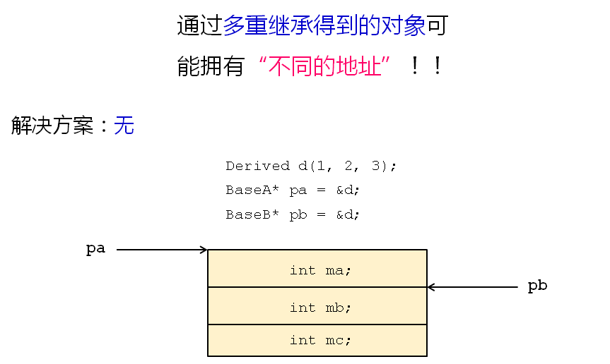
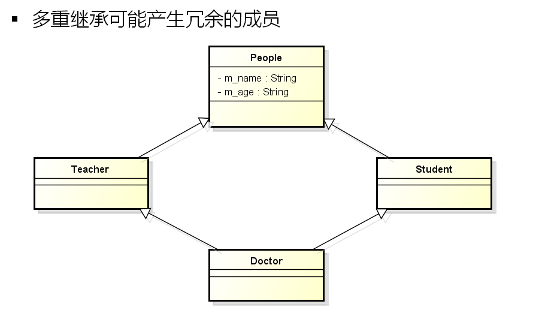
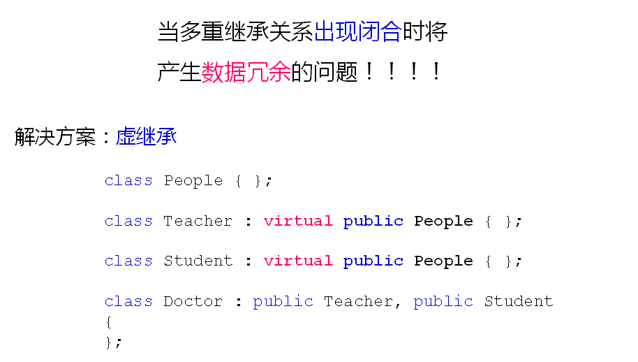

# 被遗弃的多重继承(上)
## C++中的多重继承
- C++支持编写多重继承的代码
  - 一个子类可以拥有多个父类
  - 子类拥有所有父类的成员变量
  - 子类继承所有父类的成员函数
  - 子类对象可以当做任意父类对象使用
- 多重继承的语法规则
  
  

## 多重继承的问题一

## 多重继承的问题二

- 虚继承能够解决数据冗余问题
- 中间层父类不再关心顶层父类的初始化
- 最终子类必须直接调用顶层父类的构造函数
  
## 小结
- C++支持多重继承的编程方式
- 多重继承容易带来问题
  - 可能出现“同一个对象的地址不同”的情况
  - 虚继承可以解决数据冗余的问题
  - 虚继承使得架构设计可能出现问题