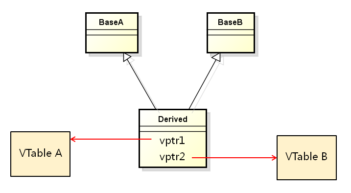
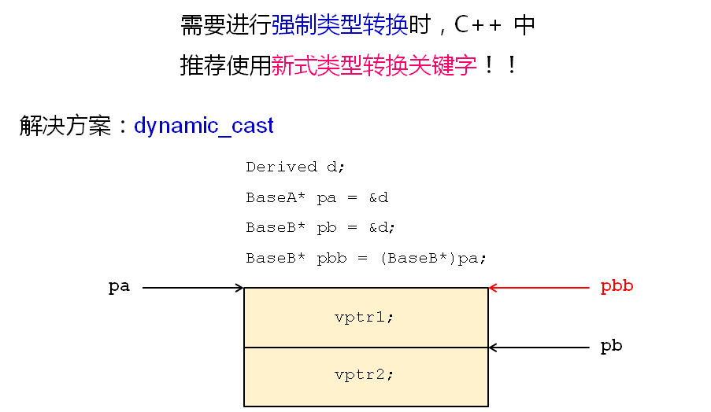
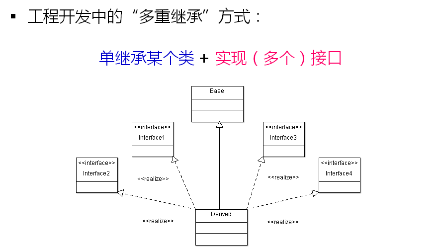

# 被遗弃的多重继承(下)
## 多重继承的问题三
- 多重继承可能产生多个虚函数表
  
  

  

## 正确的使用多重继承

- 一些有用的工程建议
  - 先继承自一个父类，然后实现多个接口
  - 父类中提供equal()成员函数
  - equal()成员函数用于判断指针是否指向当前对象
  - 与多重继承相关的强制类型转换用dynamic_cast完成
  
## 小结
- 多继承中可能出现多个虚函数表指针
- 与多重继承相关的强制类型转换用dynamic_case完成
- 工程开发中采用“单继承多接口”的方式使用多继承
- 父类提供成员函数用于判断指针是否指向当前对象