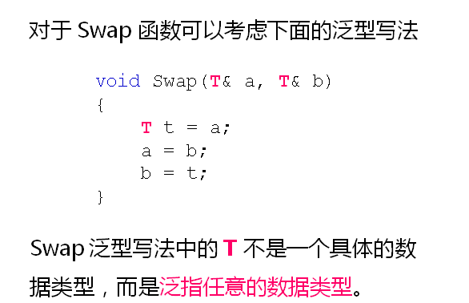
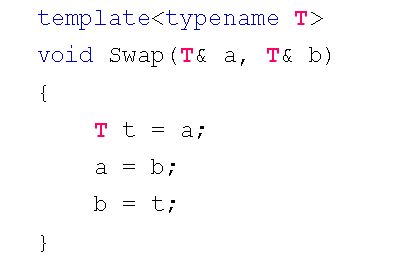
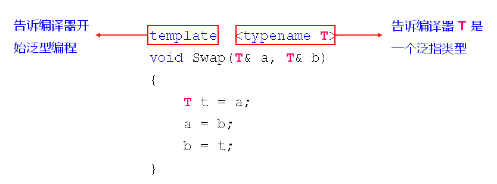
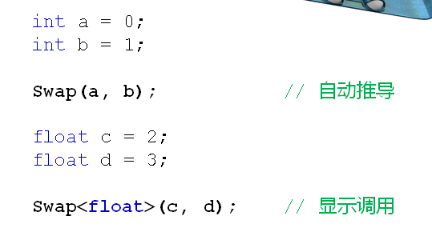

# 函数模板的概念和意义
## 交换变量的方法
- 定义宏代码块
  - 优点：代码复用，适合所有的类型
  - 缺点：编译器不知道宏的存在，缺少类型检查
- 定义函数
  - 优点：真正的函数调用，编译器对类型进行检查
  - 缺点：根据类型重复定义函数，无法代码复用
  
## 泛型编程
- 泛型编程的概念
  - 不考虑具体数据类型的编程方式
  
  

## 函数模板
- C++中泛型编程
  - 函数模板
    - 一种特殊的函数可用不同类型进行调用
    - 看起来和普通函数很相似，区别是类型可被参数化
    
    

- 函数模板的语法规则
  - template关键字用于声明开始进行泛型编程
  - typename关键字用于声明泛指类型
  
  

- 函数模板的使用
  - 自动类型推导调用
  - 具体类型显示调用
  
  

## 小结
- 函数模板是泛型编程在C++中的应用方式之一
- 函数模板能够根据实参对参数类型进行推导
- 函数模板支持显示的指定参数类型
- 函数模板是C++中重要的代码复用方式