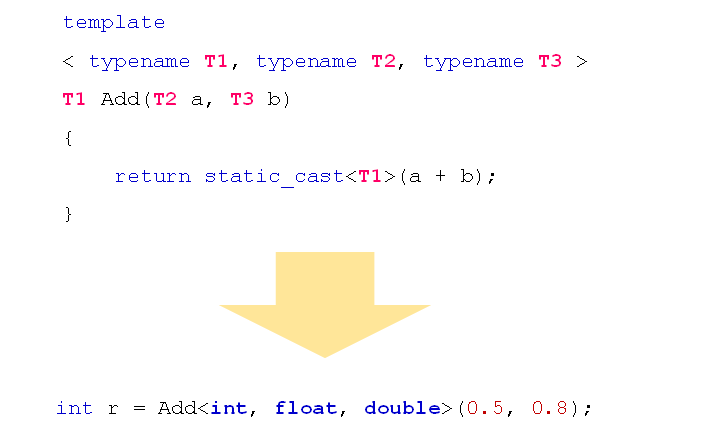
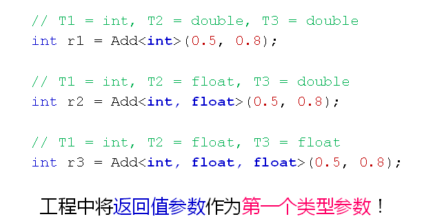
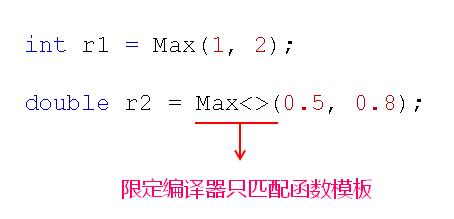

# 深入理解函数模板
## 函数模板
- 函数模板深入理解
  - 编译器从函数模板通过具体类型产生不同的函数
  - 编译器会对函数模板进行两次编译
    - 对模板代码本身进行编译
    - 对参数替换后的代码进行编译
- 注意事项：
  - 函数模板本身不允许隐式类型转换
    - 自动推导类型时，必须严格匹配
    - 显示类型指定时，能够进行隐式类型转换
  
## 多参数函数模板
- 函数模板可以定义任意多个不同的类型参数
  
  

- 对于多参数函数模板
  - 无法自动推导返回值类型
  - 可以从左向右部分指定类型参数
  
  

## 重载函数模板
- 函数模板可以像普通函数一样被重载
  - C++编译器优先考虑普通函数
  - 如果函数模板可以产生一个更好的匹配，那么选择模板
  - 可以通过空模板实参列表限定编译器只匹配模板
  
  

## 小结
- 函数模板通过具体类型产生不同的函数
- 函数模板可以定义任意多个不同的类型参数
- 函数模板中的返回值类型必须显示指定
- 函数模板可以像普通函数一样被重载